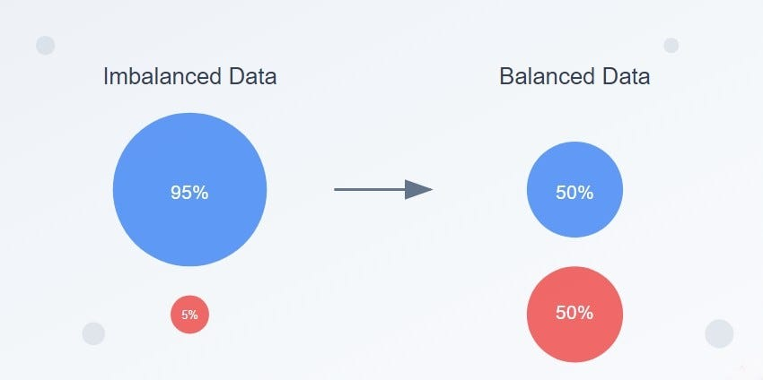
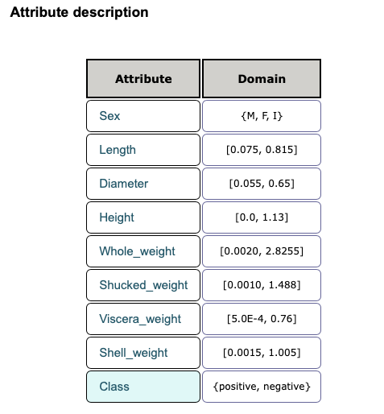
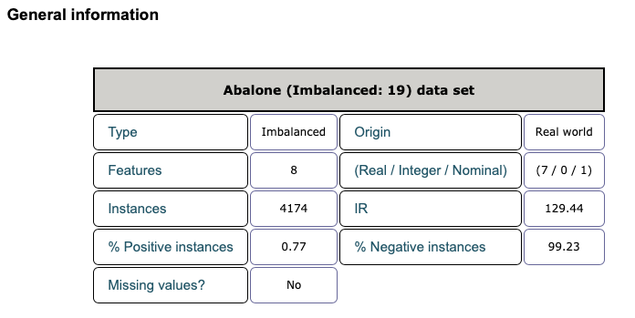

# Handling Imbalanced Data in Machine Learning Models

<p>
  
</p>

[img source: Amit Jangir Medium Article](https://medium.com/@amitkumarjangir2806/heres-how-you-can-tackle-imbalanced-datasets-559bd4b95dfa)

## Project Description

This project was inspired by the [How to Handle Imbalanced Data in Machine Learning Classification](https://www.justintodata.com/imbalanced-data-machine-learning-classification/) article from authors of https://www.justintodata.com.

The goal of the project is to understand how to handle and mitigate imbalanced datasets in order to build classification models. When we talk about imbalanced data sets in machine learning we are usually talking about situations were the _label_ or _classes_ of a dataset are not distributed equally. A very common example in Machine Learning (ML) literature is if we want to predict Postivie Cancer diagnosis. Here we have two classes: Postive Cancer Diagnosis, (Cancer) and Negative Cancer Diagnosis (No Cancer). In such data sets, the number of positive cancer diagnosis are much less than negative or non-cancer diagnosis -- the data set classes are imbalanced.

**Majority class** - is the more common label in a class-imbalanced dataset. For example, given a dataset containing 99% negative labels and 1% positive labels, the negative labels are the majority class, just like our cancer diagnosis example

**Minority class** - is the less common label in a class-imbalanced dataset. For example, given a dataset containing 99% negative labels and 1% positive labels, the positive labels are the minority class.

If we just apply imbalanced data directly into a machine learning algorithm, we are going to run into problems. The model no doubt will ignore the minority class as there are so few examples to train on in comparison to the majority class, so expect incorrect predictions for the underrepresented class. These erroneous predictions are especially bad if what we really care about predicting correctly is the minority class like in our cancer diagnosis example.

### What this Project Does Specifically

The project:

- Loads and inspects and imbalanced data set
- Performs various methods to make the data set either more balanced or at least weighted to handle the imblances
- Builds various binary classifiers from the rebalanced or weighted data sets
- Evaluates the performance of each classifier using an Area Under the Receiver-Operating Characteris (ROC) Curve [(AUC)](https://developers.google.com/machine-learning/glossary#AUC) score.

---

## Objective

The project contains the key elements:

- `Area Under the Receiver-Operating Characteris (ROC) Curve [(AUC)]` scoreing for classifer identification,
- `Git` (version control),
- `imblearn` Python library to perform oversampling and undersampling,
- `Jupyter` Python coded notebooks,
- `Numpy` for arrays and numerical operations,
- `Pandas` for dataframe usage,
- `Python` the standard modules,
- `SMOTE` to help with oversampling,
- `Scikit-Learn` to get training and test datasets,
- `Tomek` to help with undersampling,
- `uv` package management including use of `ruff` for linting and formatting

## Tech Stack


---

## Getting Started

Here are some instructions to help you set up this project locally.

---

## Installation Steps

- The Python version used for this project is `Python 3.12` to be compatible with some of the other packages
- `imblearn` version 0.0,
- `scikit-learn` version 1.6.1,
- `imbalanced-learn` version 0.13.0,

### Clone the Repo

1. Clone the repo (or download it as a zip file):

   ```bash
   git clone https://github.com/beenlanced/ml_handling_imbalanced_data.git
   ```

2. Create a virtual environment named `.venv` using `uv` Python version 3.11:

   ```bash
   uv venv --python=3.12
   ```

3. Activate the virtual environment: `.venv`

   On macOs and Linux:

   ```bash
   source .venv/bin/activate #mac
   ```

   On Windows:

   ```bash
    # In cmd.exe
    venv\Scripts\activate.bat
   ```

4. Install packages using `pyproject.toml` or (see special notes section)

   ```bash
   uv pip install -r pyproject.toml
   ```

### Running the Codeded Examples

1. **Run the Python Coded Jupyter Notebooks**

---

## Data Set

An imbalanced version of the [Abalone](https://sci2s.ugr.es/keel/dataset.php?cod=115), a species of marine snails, data set, where the positive examples belong to `class 19` and the negative examples belong to the rest.

Attribute description of the data set:

<p>
  
</p>

Abalone general information:

<p>
  
</p>

---

### Final Words

Thanks for visiting.

Give the project a star (⭐) if you liked it or if it was helpful to you!

You've `beenlanced`! 😉

---

## Acknowledgements

I would like to extend my gratitude to all the individuals and organizations who helped in the development and success of this project. Your support, whether through contributions, inspiration, or encouragement, have been invaluable. Thank you.

Specifically, I would like to acknowledge:

- [How to handle Imbalanced Data in machine learning classification](https://www.justintodata.com/imbalanced-data-machine-learning-classification/) from authors of https://www.justintodata.com as the inspiration for this project.

- [Hema Kalyan Murapaka](https://www.linkedin.com/in/hemakalyan) and [Benito Martin](https://martindatasol.com/blog) for sharing their README.md templates upon which I have derived my README.md.

- The folks at Astral for their UV [documentation](https://docs.astral.sh/uv/)

---

## License

This project is licensed under the MIT License - see the [LICENSE](./LICENSE) file for details
